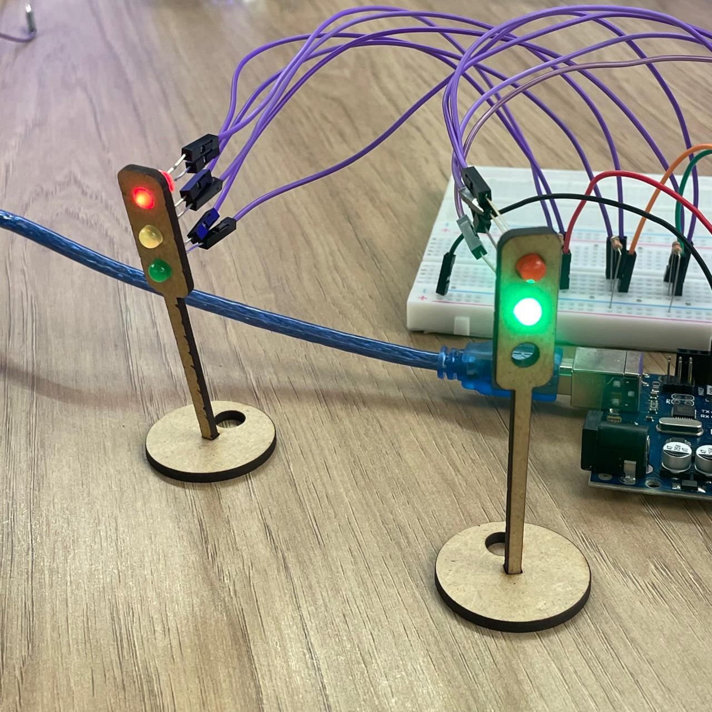
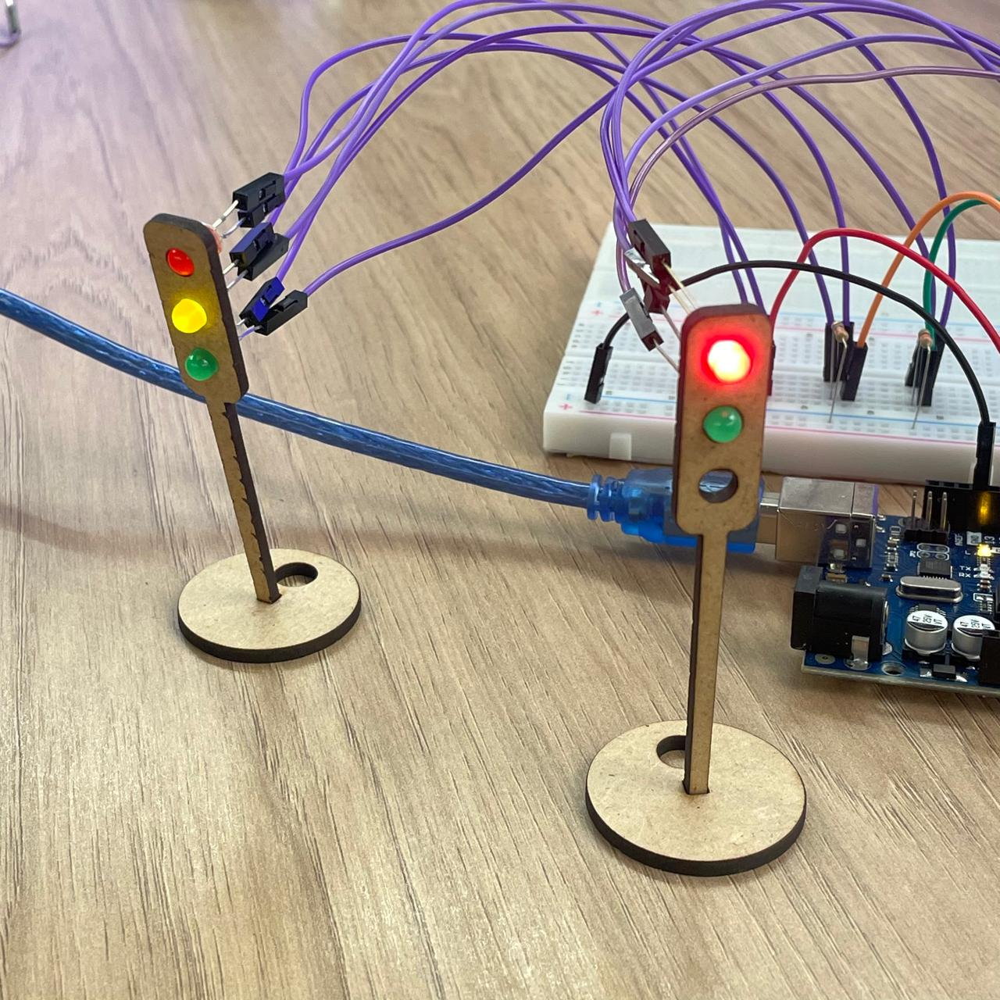
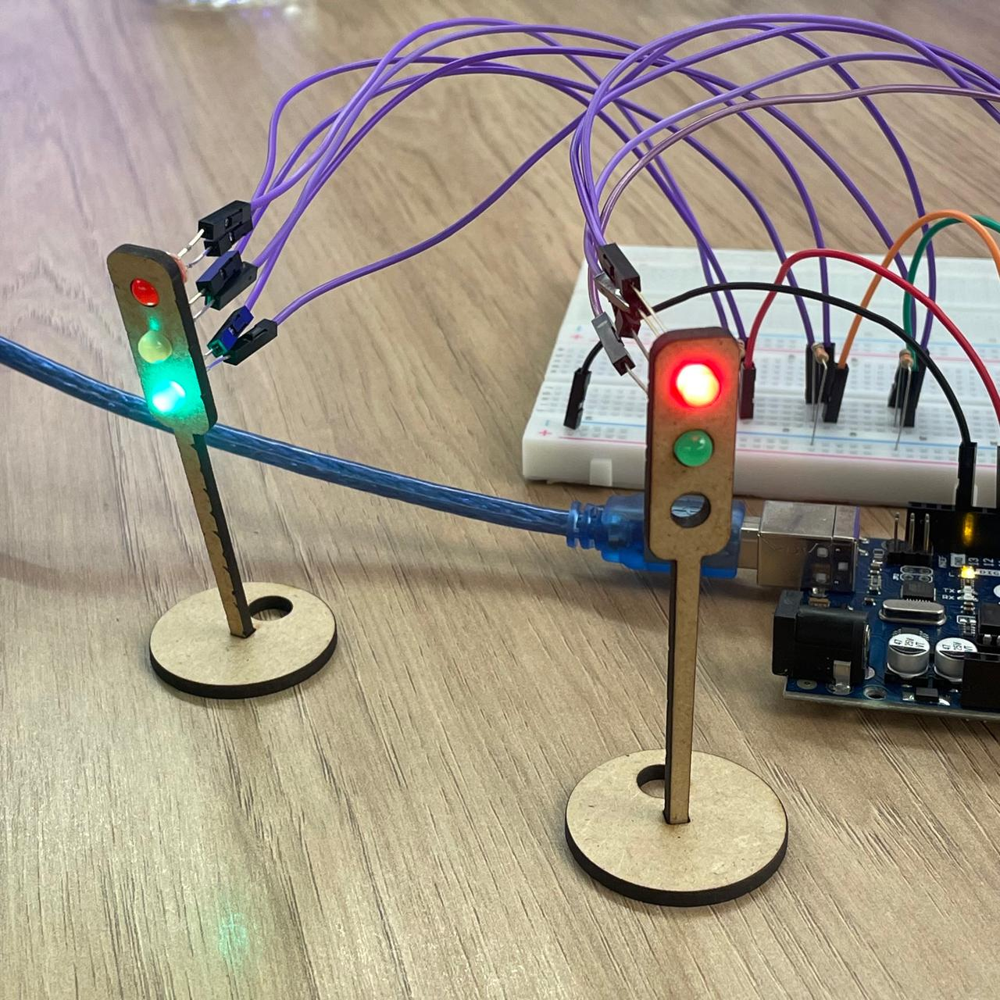

# Semáforo 
Semáforo tradicional integrado ao semáforo de pedestres.

## Avaliação
### Avaliadora: Yasmin | Avaliada: Mirella

| Critério                                                                                                 | Contempla (Pontos) | Contempla Parcialmente (Pontos) | Não Contempla (Pontos) | Observações do Avaliador |
|---------------------------------------------------------------------------------------------------------|--------------------|----------------------------------|--------------------------|---------------------------|
| Montagem física com cores corretas, boa disposição dos fios e uso adequado de resistores                | Até 3              | Até 1,5                            | 0                        | (3) Contempla: As conexões foram feitas de forma adequada. |
| Temporização adequada conforme tempos medidos com auxílio de algum instrumento externo                  | Até 3              | Até 1,5                          | 0                        | (3) Contempla: Cada cor de LED segue o tempo solicitado. |
| Código implementa corretamente as fases do semáforo e estrutura do código (variáveis representativas e comentários) | Até 3              | Até 1,5                          | 0                        | (3) Contempla: Código está bem comentado e as variáveis fazem sentido, tornando o código de mais fácil entendimento. |
| Extra: Implmeentou um componente de liga/desliga no semáforo e/ou usou ponteiros no código | Até 1              |  Até 0,5                         | 0                        | (1) Contempla: Foram utilizados dois semáforos, um normal e outro de pedestres. A relação dos dois se dá por um botão que, quando é apertado, acende o vermelho no semáforo normal e acende o verde no semáforo de pedestre.                       |
|  |                                                             |  | |**Pontuação Total:** 10|

## Evidências

  Figura 1 - Fotografia do Semáforo Vermelho  

    
  Fonte: Autora (2024).

  Figura 2 - Fotografia do Semáforo Amarelo  

    
  Fonte: Autora (2024).

  Figura 3 - Fotografia do Semáforo Verde  

    
  Fonte: Autora (2024).

  Gif 1 - Semáforo em Ação  

    
  Fonte: Autora (2024).

